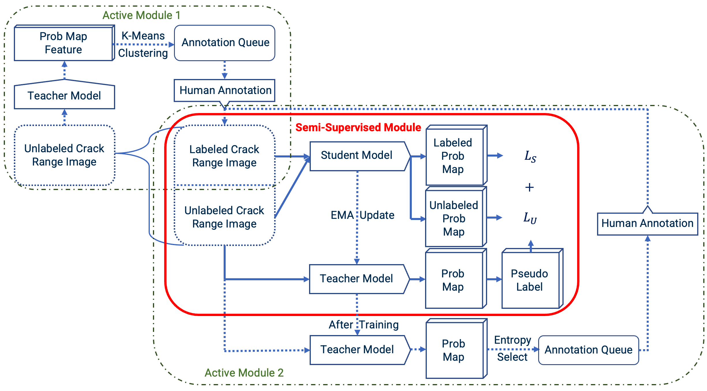

# Semi-Automatic Crack Annotation for Semantic Segmentation using Semi-Supervised Learning

Background Paper: [Semi-Supervised Semantic Segmentation Using Unreliable Pseudo Labels](https://arxiv.org/abs/2203.03884), CVPR 2022.

Please refer to our **[project page](https://haochen-wang409.github.io/U2PL/)** for qualitative results.

> **Abstract.**
> The detection of surface cracks is essential for ensuring the safety and serviceability of civil engineering infrastructure. Cracks often serve as early indicators of degradation, and their detection allows for the implementation of preventative measures. Regular inspections and maintenance of aging facilities are crucial in order to reduce the risk of structural deterioration. Traditional crack detection, however, primarily relies on manual inspection, which is heavily dependent on professionals and can be both inefficient and costly. With the advancement of computer vision and image processing techniques, automatic crack detection methods have gradually replaced conventional manual inspection, providing more efficient and objective results.
To utilize machine learning approaches for automatic crack detection, large and diverse datasets are required to train accurate deep learning models. Data annotation is necessary to identify relevant features that provide meaning to the computer. Within the framework of automatic crack detection, semantic segmentation is one of the most common and promising data annotation techniques. Deep learning models using semantic segmentation have demonstrated excellent performance in crack detection tasks. However, obtaining the best performance from these models typically requires fully supervised segmentation methods with large amounts of annotated data, which can be both time-consuming and labor-intensive.
To address this challenge, in this project, we introduce a semi-supervised semantic segmentation network for crack detection that uses a small number of labeled samples and a large number of unlabeled samples. Our aim is to identify the most informative samples for model training, thereby reducing overhead annotation costs while maintaining sufficient accuracy levels. Furthermore, an active learning module is employed to guide the annotation order and determine the optimal ratio of unlabeled to labeled images.

> A semi-supervised learning module with an active module is designed to validate the proposed active module's ability to guide annotation order and determine the optimal ratio between labeled and unlabeled data. The module is comprised of a student model and a teacher model, with both models employing a U-Net architecture using a ResNet encoder and a DeepLabV3+ decoder. The active module is incorporated to provide annotation guidance throughout the learning process.
The loss function used for all models, except the fully supervised baseline model, is a combination of supervised loss and unsupervised loss with equal weights. Both supervised and unsupervised losses are composed of cross-entropy loss and DICE loss, addressing the unbiased ratio between class[0] (pavement background) and class[1] (crack). DICE loss tackles data imbalance and measures similarities between two images, while cross-entropy measures the difference between two probability distributions for a variable.
Evaluation results indicate that the best performance is achieved using supervised learning. And the active module does not show significant improvement in the annotation process under insufficient training circumstances, and the active criterion may not be appropriately chosen. I




## Checkpoints

- Models on PASCAL VOC 2012 (ResNet101-DeepLabv3+) can be found [here](https://drive.google.com/drive/folders/1_BcixhrEqJEMo3lzKTKPJ_7gCWEjUBWp).

- Models on Cityscapes with AEL (ResNet101-DeepLabv3+)

| 1/16 (186)                                                                                         | 1/8 (372)                                                                                          | 1/4 (744)                                                                                          | 1/2 (1488)                                                                                         |
| -------------------------------------------------------------------------------------------------- | -------------------------------------------------------------------------------------------------- | -------------------------------------------------------------------------------------------------- | -------------------------------------------------------------------------------------------------- |
| [Google Drive](https://drive.google.com/file/d/1IZb9cAKSHajAnWYFHDq_qDecKcJMXvl5/view?usp=sharing) | [Google Drive](https://drive.google.com/file/d/1QyG-qPdjaUZ2qEkQTr70ioLeNDOI943p/view?usp=sharing) | [Google Drive](https://drive.google.com/file/d/1xgIICfZw_5bf-FFH9GtdO_85kQCnQmsT/view?usp=sharing) | [Google Drive](https://drive.google.com/file/d/1IlN5IIUMO4pZ_b_9Xo6659AbUV0dllfM/view?usp=sharing) |
| [Baidu Drive](https://pan.baidu.com/s/1DF9WTiV2mLfY2V9SHP14_w) <br>Fetch Code: rrpd                | [Baidu Drive](https://pan.baidu.com/s/1TjtHQM2tXy0H8b-reXMHJw) <br>Fetch Code: welw                | [Baidu Drive](https://pan.baidu.com/s/1LyecRU6rPbrrxgxy2qI65w) <br>Fetch Code: qwcd                | [Baidu Drive](https://pan.baidu.com/s/1ngb7mS0I6UMj1cff_40cYg) <br>Fetch Code: 4p8r                |


## Installation

```bash
git clone https://github.com/Haochen-Wang409/U2PL.git && cd U2PL
conda create -n u2pl python=3.6.9
conda activate u2pl
pip install -r requirements.txt
pip install pip install torch==1.8.1+cu102 torchvision==0.9.1+cu102 -f https://download.pytorch.org/whl/torch_stable.html
```

## Usage

U<sup>2</sup>PL is evaluated on the crack dataset, cityscapes and PASCAL VOC.
### Prepare Data


<details>
  <summary>For Cityscapes</summary>

Download "leftImg8bit_trainvaltest.zip" from: https://www.cityscapes-dataset.com/downloads/

Download "gtFine.zip" from: https://drive.google.com/file/d/10tdElaTscdhojER_Lf7XlytiyAkk7Wlg/view?usp=sharing

Next, unzip the files to folder ```data``` and make the dictionary structures as follows:

```angular2html
data/cityscapes
├── gtFine
│   ├── test
│   ├── train
│   └── val
└── leftImg8bit
    ├── test
    ├── train
    └── val
```

</details>


<details>
  <summary>For PASCAL VOC 2012</summary>

Refer to [this link](https://github.com/zhixuanli/segmentation-paper-reading-notes/blob/master/others/Summary%20of%20the%20semantic%20segmentation%20datasets.md) and download ```PASCAL VOC 2012 augmented with SBD``` dataset.

And unzip the files to folder ```data``` and make the dictionary structures as follows:

```angular2html
data/VOC2012
├── Annotations
├── ImageSets
├── JPEGImages
├── SegmentationClass
├── SegmentationClassAug
└── SegmentationObject
```
</details>

<details>
  <summary>For Crack dataset</summary>

Refer to [this link](https://drive.google.com/drive/folders/1MHFEwdvpVYmJw2wi9qRBrdXnPSZv2-_m?usp=share_link) and download ```data_crack``` dataset.

And unzip the files to folder ```data``` and make the dictionary structures as follows:

```angular2html
data/Crack_Dataset/data_crack
├── Data_train
    ├──split 1
        ├──Unlabeled_Range_crop
        ├──labeled_Segmentation_crop
        ├──labeled_Segmentation_rough
    ├──split 2 
        ├──Unlabeled_Range_crop
        ├──labeled_Segmentation_crop
        ├──labeled_Segmentation_rough
    ├──hard cases
├── Data_test
    ├──val_data
        ├──Segmentation_crop
        ├──Range_crop
    ├──test data
        ├──labeled_Segmentation_crop
        ├──Unlabeled_Range_crop

```
</details>


Finally, the structure of dictionary ```data``` should be as follows:

```angular2html
data
├── Crack_Dataset
    ├── data_crack
        ├── Data_test
        ├── Data_train
├── cityscapes
│   ├── gtFine
│   └── leftImg8bit
├── splits
│   ├── cityscapes
│   └── pascal
└── VOC2012
    ├── Annotations
    ├── ImageSets
    ├── JPEGImages
    ├── SegmentationClass
    ├── SegmentationClassAug
    └── SegmentationObject
```

### Prepare Pretrained Backbone

Before training, please download ResNet101 pretrained on ImageNet-1K from one of the following:
  - [Google Drive](https://drive.google.com/file/d/1nzSX8bX3zoRREn6WnoEeAPbKYPPOa-3Y/view?usp=sharing)
  - [Baidu Drive](https://pan.baidu.com/s/1FDQGlhjzQENfPp4HTYfbeA) Fetch Code: 3p9h

After that, modify ```model_urls``` in ```semseg/models/resnet.py``` to ```</path/to/resnet101.pth>```

### Train a Fully-Supervised Model
For instance, we can train a model on crack data with only ```50``` labeled data for supervision by:
```bash
cd experiments/data_crack/suponly
# use torch.distributed.launch
sh train.sh <num_gpu> <port>

# or use slurm
# sh slurm_train.sh <num_gpu> <port> <partition>
```
For instance, we can train a model on PASCAL VOC 2012 with only ```1464``` labeled data for supervision by:
```bash
cd experiments/pascal/1464/suponly
# use torch.distributed.launch
sh train.sh <num_gpu> <port>

# or use slurm
# sh slurm_train.sh <num_gpu> <port> <partition>
```
Or for Cityscapes, a model supervised by only ```744``` labeled data can be trained by:
```bash
cd experiments/cityscapes/744/suponly
# use torch.distributed.launch
sh train.sh <num_gpu> <port>

# or use slurm
# sh slurm_train.sh <num_gpu> <port> <partition>
```
After training, the model should be evaluated by
```bash
sh eval.sh
```
### Train a Semi-Supervised Model

We can train a model on PASCAL VOC 2012 with ```1464``` labeled data and ```9118``` unlabeled data for supervision by:
```bash
cd experiments/pascal/1464/ours
# use torch.distributed.launch
sh train.sh <num_gpu> <port>

# or use slurm
# sh slurm_train.sh <num_gpu> <port> <partition>
```
We can train a model on crack_data with ```80``` labeled data and ```80``` unlabeled data for supervision by:
```bash
cd experiments/data_crack/ours
# use torch.distributed.launch
sh train.sh <num_gpu> <port>

# or use slurm
# sh slurm_train.sh <num_gpu> <port> <partition>
```
Or for Cityscapes, a model supervised by ```744``` labeled data and ```2231``` unlabeled data can be trained by:
```bash
cd experiments/cityscapes/744/ours
# use torch.distributed.launch
sh train.sh <num_gpu> <port>

# or use slurm
# sh slurm_train.sh <num_gpu> <port> <partition>
```
After training, the model should be evaluated by
```bash
sh eval.sh
```

### Note
```<num_gpu>``` means the number of GPUs for training.

To reproduce  results,  recommend you follow the settings:
- Cityscapes: ```4 * V100 (32G)``` for SupOnly and ```8 * V100 (32G)``` for Semi-Supervised
- PASCAL VOC 2012: ```2 * V100 (32G)``` for SupOnly and ```4 * V100 (32G)``` for Semi-Supervised
Therefore, we recommend you run 3 times and get the average performance.


## Acknowledgement

The contrastive learning loss and strong data augmentation (CutMix, CutOut, and ClassMix) 
are borrowed from **ReCo**.
We reproduce our U<sup>2</sup>PL based on **AEL** on branch ```with_AEL```.
- ReCo: https://github.com/lorenmt/reco
- AEL: https://github.com/hzhupku/SemiSeg-AEL


## Citation
```bibtex
@inproceedings{wang2022semi,
    title={Semi-Supervised Semantic Segmentation Using Unreliable Pseudo Labels},
    author={Wang, Yuchao and Wang, Haochen and Shen, Yujun and Fei, Jingjing and Li, Wei and Jin, Guoqiang and Wu, Liwei and Zhao, Rui and Le, Xinyi},
    booktitle={Proceedings of the IEEE/CVF International Conference on Computer Vision and Pattern Recognition (CVPR)},
    year={2022}
}
```

## Contact

- Jayda Ritchie, jritchie31@gatech.edu
- Haolin Wang, hlwang98@gatech.edu
- Xiaoyue Wang, xzhang3067@gatech.edu

